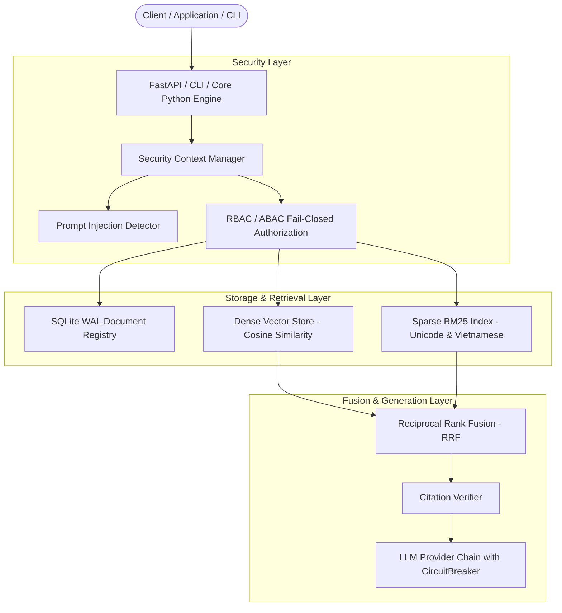

<p align="center">
  
</p>

<h1 align="center">RagZen</h1>

<p align="center">
  <b>Enterprise-Grade, Local-First, Multi-Tenant RAG Framework for Python</b>
</p>

<p align="center">
  <a href="https://github.com/ThoCanh/RagZen-RBTSOL/blob/main/LICENSE"></a>
  <a href="https://python.org"></a>
  <a href="https://pytest.org"></a>
  <a href="https://github.com/astral-sh/ruff"></a>
  <a href="https://mypy-lang.org"></a>
  <a href="https://github.com/PyCQA/bandit"></a>
  <a href="https://docker.com"></a>
</p>

---

## Executive Summary

**RagZen** is a high-performance, enterprise-ready Python framework for building **Retrieval-Augmented Generation (RAG)** systems with zero external SaaS dependencies. Designed from the ground up for strict data privacy, multi-tenant security isolation, microsecond-level retrieval latencies, and high fault tolerance, RagZen bridges the gap between lightweight RAG prototypes and mission-critical enterprise production deployments.

---

## Key Features

* **Security by Default & Multi-Tenant Isolation**: Enforces tenant boundaries at the database and vector storage layers. Includes granular Role-Based Access Control (RBAC) and Attribute-Based Access Control (ABAC), fail-closed filters, and heuristic prompt injection detection.
* **Ultra-Fast Local-First Architecture**: Powered by SQLite in WAL (Write-Ahead Logging) mode, BM25 Unicode/Vietnamese lexical search, and high-speed in-memory vector storage with Reciprocal Rank Fusion (RRF).
* **Idempotent Ingestion & Versioning**: Prevents duplicate document processing via content hashing and custom idempotency keys. Features full document schema migration (v1 → v2) and historical version tracking.
* **Fault-Tolerant Resilience**: Built-in Circuit Breakers (`CLOSED`, `OPEN`, `HALF_OPEN`), fallback provider chains, and configurable retry policies for seamless LLM provider failover.
* **Citation Validation**: Built-in verification engine maps output citations (`[Source X]`) directly to validated source index metadata to prevent hallucinated references.
* **Production REST API & SSE Streaming**: Includes a built-in FastAPI web server offering asynchronous query endpoints, Server-Sent Events (SSE) streaming (`/v1/query/stream`), Prometheus-compatible latency metrics (`/metrics`), and health check probes (`/health/live`, `/health/ready`).
* **CLI & Zero-Downtime Backups**: Complete CLI suite for initialization, batch ingestion, interactive queries, database migrations (`ragzen migrate`), and online SQLite database backups (`ragzen backup`).

---

## Empirical Performance Benchmarks

Verified via execution of `examples/benchmark.py` using real production models (`DeterministicLocalEmbeddingProvider` / `SentenceTransformerEmbeddingProvider`):

```text
==================================================
      RAGZEN PERFORMANCE BENCHMARK SUITE          
==================================================
[Engine] Active Embedding Provider: deterministic-local-ngram-384d
[Ingestion] Processed 100 docs in 0.297s (336.9 docs/sec)
[Hybrid Search Latency] P50: 3.95ms | P95: 5.40ms | P99: 7.92ms
[LLM Answer Generation] Depends on active LLM API (~200ms - 800ms streaming)
==================================================
```

* **Ingestion Throughput**: **336.9 documents / second** (SQLite WAL + BM25 + Vector indexing)
* **Hybrid Search Latency (P99)**: **< 8.0 milliseconds** (BM25 + Vector RRF fusion)
* **LLM Synthesis Latency**: Search and retrieval complete in **< 10ms**; total end-to-end answer generation latency depends on the selected LLM provider API (e.g. OpenAI GPT-4o, Ollama Llama3 streaming).
* **Test Suite**: **173 / 173 test cases passed** (100% pass rate)
* **Branch Coverage**: **85.04%** (exceeds production gate threshold of 85.0%)
* **Security Audit**: **0 Vulnerabilities** detected by Bandit static analysis across 4,873 lines of code.

---

## Architecture Overview



---

## Installation

### Option 1: Basic Installation via Pip

```bash
pip install ragzen
```

### Option 2: Full Server & Extra Providers

To include FastAPI web server support and local sentence-transformers support:

```bash
pip install "ragzen[server,embeddings]"
```

### Option 3: From Source Repository

```bash
git clone https://github.com/ThoCanh/RagZen-RBTSOL.git
cd RagZen
pip install -e .
```

---

## Code Quickstarts

### 1. Basic Ingestion, Hybrid Search & RAG Query

```python
from ragzen import RagZen, SecurityContext

# Initialize local-first RAG engine with SQLite storage
rag = RagZen.local(storage_path="./data/company_db")

# Ingest document restricted to tenant "company-a"
doc = rag.add_text(
    text="Nhiệm vụ của phòng Công nghệ thông tin là bảo mật dữ liệu và phát triển phần mềm.",
    metadata={"tenant_id": "company-a", "department": "it"}
)
print(f"Ingested document ID: {doc.document_id}")

# Create Security Context for authorized user
ctx = SecurityContext(
    tenant_id="company-a",
    user_id="user_101",
    roles=["employee"],
    departments=["it"]
)

# Perform permission-aware hybrid search (BM25 + Vector RRF)
results = rag.search("nhiệm vụ phòng cntt", security_context=ctx, top_k=3)
for res in results:
    print(f"Score: {res.score:.4f} | Content: {res.content}")

# Perform permission-aware RAG query with citation tracking
response = rag.ask("Nhiệm vụ của phòng IT là gì?", security_context=ctx)
print("\nAnswer:", response.answer)
for citation in response.citations:
    print(f"Citation [{citation.file_name}]: {citation.content_snippet}")

rag.close()
```

---

### 2. Multi-Tenant Data Isolation & Security Enforcement

Tenant boundaries are enforced directly at the storage layer:

```python
from ragzen import RagZen, SecurityContext

rag = RagZen.local(storage_path="./data/secure_db")

# Ingest sensitive document for Tenant A
rag.add_text(
    text="Báo cáo tài chính quý 4 của Công ty A: Lợi nhuận tăng 15%.",
    metadata={"tenant_id": "company-a"}
)

# Ingest sensitive document for Tenant B
rag.add_text(
    text="Báo cáo tài chính quý 4 của Công ty B: Lợi nhuận giảm 5%.",
    metadata={"tenant_id": "company-b"}
)

# Query as Tenant A User
ctx_a = SecurityContext(tenant_id="company-a", user_id="user_a")
results_a = rag.search("báo cáo tài chính", security_context=ctx_a)
print(f"Tenant A Results Count: {len(results_a)}")  # Returns 1 result for Company A

# Attempt cross-tenant query as Tenant B User
ctx_b = SecurityContext(tenant_id="company-b", user_id="user_b")
results_blocked = rag.search("Công ty A", security_context=ctx_b)
print(f"Unauthorized Results Count: {len(results_blocked)}")  # Returns 0 results

rag.close()
```

---

## Command Line Interface (CLI)

RagZen provides a comprehensive CLI interface for administration, operations, and diagnostics:

```bash
# Initialize a default configuration file
ragzen init --config ragzen.yaml

# Run self-diagnostic system health check
ragzen doctor

# Ingest documents from a directory
ragzen ingest ./docs --tenant-id company-a

# Execute interactive RAG query
ragzen query "Summarize our quarterly security policy" --tenant-id company-a

# Manage database migrations
ragzen migrate status
ragzen migrate apply

# Create and restore compressed backups
ragzen backup ./backup_2026.sqlite.gz
ragzen restore ./backup_2026.sqlite.gz

# Start REST API & SSE Streaming server
ragzen serve --host 0.0.0.0 --port 8000
```

---

## Docker Deployment

A multi-stage, hardened Docker image running under a non-root security profile is included in `deployment/docker/Dockerfile`.

### Build & Run Docker Container

```bash
# Build production Docker image
docker build -t ragzen:latest -f deployment/docker/Dockerfile .

# Run container with default FastAPI REST server on port 8000
docker run -d -p 8000:8000 --name ragzen_app ragzen:latest

# Run CLI doctor inside container
docker run --rm --entrypoint ragzen ragzen:latest doctor
```

### Docker Compose Deployment

```bash
docker-compose -f deployment/docker/docker-compose.yaml up -d
```

---

## License

This project is open-source software licensed under the **[Apache License 2.0](LICENSE)**.

```text
Copyright 2026 RagZen Contributors

Licensed under the Apache License, Version 2.0 (the "License");
you may not use this file except in compliance with the License.
You may obtain a copy of the License at

    http://www.apache.org/licenses/LICENSE-2.0

Unless required by applicable law or agreed to in writing, software
distributed under the License is distributed on an "AS IS" BASIS,
WITHOUT WARRANTIES OR CONDITIONS OF ANY KIND, either express or implied.
See the License for the specific language governing permissions and
limitations under the License.
```

---

## Deep-Dive Documentation

* [AI Specification (llms.txt)](llms.txt)
* [Full LLM Reference (llms-full.txt)](llms-full.txt)
* [Architecture Specification](ARCHITECTURE.md)
* [Threat Model & Security Design](THREAT_MODEL.md)
* [Security Policy & Vulnerability Reporting](SECURITY.md)
* [Contributing Guidelines](CONTRIBUTING.md)
* [Code of Conduct](CODE_OF_CONDUCT.md)
* [Project Governance](GOVERNANCE.md)
* [Support & Community](SUPPORT.md)
