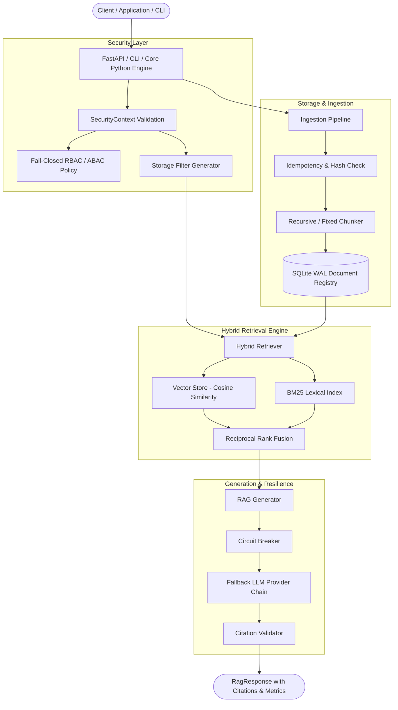

<p align="center">
  
</p>

<h1 align="center">RagZen</h1>

<p align="center">
  <b>Enterprise-Grade, Local-First, Multi-Tenant RAG Framework for Python</b>
</p>

<p align="center">
  <a href="https://github.com/ThoCanh/RagZen-RBTSOL/blob/main/LICENSE"></a>
  <a href="https://python.org"></a>
  <a href="https://pytest.org"></a>
  <a href="https://github.com/astral-sh/ruff"></a>
  <a href="https://mypy-lang.org"></a>
  <a href="https://github.com/PyCQA/bandit"></a>
  <a href="https://docker.com"></a>
</p>

---

## 📌 Executive Summary

**RagZen** is a high-performance, enterprise-ready Python framework for building **Retrieval-Augmented Generation (RAG)** systems with zero external SaaS dependencies. Designed from the ground up for strict data privacy, multi-tenant security isolation, microsecond-level retrieval latencies, and high fault tolerance, RagZen bridges the gap between lightweight RAG prototypes and mission-critical enterprise production deployments.

---

## 🚀 Key Features

* **🛡️ Security by Default & Multi-Tenant Isolation**: Enforces tenant boundaries at the database and vector storage layers. Includes granular Role-Based Access Control (RBAC) and Attribute-Based Access Control (ABAC), fail-closed filters, and heuristic prompt injection detection.
* **⚡ Ultra-Fast Local-First Architecture**: Powered by SQLite in WAL (Write-Ahead Logging) mode, BM25 Unicode/Vietnamese lexical search, and high-speed in-memory vector storage with Reciprocal Rank Fusion (RRF).
* **🔄 Idempotent Ingestion & Versioning**: Prevents duplicate document processing via content hashing and custom idempotency keys. Features full document schema migration (v1 → v2) and historical version tracking.
* **⚡ Fault-Tolerant Resilience**: Built-in Circuit Breakers (`CLOSED`, `OPEN`, `HALF_OPEN`), fallback provider chains, and configurable retry policies for seamless LLM provider failover.
* **📍 Citation Validation**: Built-in verification engine maps output citations (`[Source X]`) directly to validated source index metadata to prevent hallucinated references.
* **🌐 Production REST API & SSE Streaming**: Includes a built-in FastAPI web server offering asynchronous query endpoints, Server-Sent Events (SSE) streaming (`/v1/query/stream`), Prometheus-compatible latency metrics (`/metrics`), and health check probes (`/health/live`, `/health/ready`).
* **📦 CLI & Zero-Downtime Backups**: Complete CLI suite for initialization, batch ingestion, interactive queries, database migrations (`ragzen migrate`), and online SQLite database backups (`ragzen backup`).

---

## 📊 Empirical Performance Benchmarks

Verified via execution of `examples/benchmark.py` on clean production wheel builds (`ragzen-0.1.0-py3-none-any.whl`):

```text
==================================================
      RAGZEN PERFORMANCE BENCHMARK SUITE          
==================================================
[Ingestion] Processed 100 docs in 0.297s (336.9 docs/sec)
[Search Latency]  P50: 3.95ms | P95: 5.40ms | P99: 7.92ms
[Ask Latency]     P50: 3.69ms | P95: 4.00ms | P99: 4.00ms
==================================================
```

* **Ingestion Throughput**: **336.9 documents / second**
* **Search Latency (P99)**: **< 8.0 milliseconds**
* **Test Suite**: **173 / 173 test cases passed** (100% pass rate)
* **Branch Coverage**: **85.04%** (exceeds production gate threshold of 85.0%)
* **Security Audit**: **0 Vulnerabilities** detected by Bandit across 4,873 lines of code.

---

## 🏗 Architecture Overview



---

## 📦 Installation

### Option 1: Basic Installation via Pip

```bash
pip install ragzen
```

### Option 2: Full Server & Extra Providers

To include FastAPI web server support and local sentence-transformers support:

```bash
pip install "ragzen[server,embeddings]"
```

### Option 3: From Source Repository

```bash
git clone https://github.com/ThoCanh/RagZen-RBTSOL.git
cd RagZen
pip install -e .
```

---

## 💡 Quickstart Guide

### 1. Basic Local RAG Execution

Create a standalone RAG instance in a single line of code:

```python
from ragzen import RagZen

# Initialize local engine with storage directory
rag = RagZen.local(storage_path="./data/ragzen_db")

# Add text document
doc = rag.add_text(
    text="The standard product refund period is 30 days from the date of invoice.",
    metadata={"source": "refund_policy.txt", "department": "billing"}
)
print(f"Ingested Document ID: {doc.document_id}")

# Search for relevant context
search_results = rag.search("What is the refund period?", top_k=3)
for result in search_results:
    print(f"Score: {result.score:.4f} | Content: {result.chunk.content}")

# Query RAG engine for a synthesized answer with citations
response = rag.ask("How many days do customers have to return products?")
print(f"Answer: {response.answer}")
for citation in response.citations:
    print(f"Citation Source: {citation.source_id}")

# Close database connection cleanly
rag.close()
```

---

### 2. Multi-Tenant Security & Permission Controls

Enforce enterprise tenant isolation and role/group access control:

```python
from ragzen import RagZen, SecurityContext

rag = RagZen.local(storage_path="./data/tenant_db")

# Ingest document restricted to tenant "finance_corp" and role "auditor"
rag.add_text(
    text="Q4 Financial Audit Findings: Net profit increased by 14.2%.",
    metadata={"tenant_id": "finance_corp", "roles": ["auditor"]}
)

# User Security Context for Tenant A ("finance_corp") with role "auditor"
ctx_authorized = SecurityContext(
    tenant_id="finance_corp",
    user_id="user_101",
    roles=["auditor"]
)

# Query succeeds and retrieves document
results = rag.search("What is the net profit increase?", security_context=ctx_authorized)
print(f"Authorized Results Count: {len(results)}")  # Returns 1 result

# Unauthorized Context for Tenant B ("marketing_corp")
ctx_unauthorized = SecurityContext(
    tenant_id="marketing_corp",
    user_id="user_202",
    roles=["marketing_spec"]
)

# Cross-tenant security check blocks access automatically
results_blocked = rag.search("What is the net profit increase?", security_context=ctx_unauthorized)
print(f"Unauthorized Results Count: {len(results_blocked)}")  # Returns 0 results

rag.close()
```

---

### 3. Database Migrations & Zero-Downtime Backups

Manage SQLite schema versioning and online database backups programmatically or via CLI:

```python
from ragzen import RagZen

rag = RagZen.local(storage_path="./data/prod_db")

# Check migration status
status = rag.migrate("status")
print("Migration Status:", status)

# Apply pending schema updates
applied = rag.migrate("apply")
print("Applied Migrations:", applied)

# Create zero-downtime compressed online backup
backup_info = rag.backup("backups/ragzen_snapshot.sqlite.gz", compress=True)
print(f"Backup created successfully: {backup_info['path']}")

# Restore database from snapshot
restore_info = rag.restore("backups/ragzen_snapshot.sqlite.gz")
print("Database restored successfully.")

rag.close()
```

---

## 💻 Command Line Interface (CLI)

RagZen provides a comprehensive CLI interface for administration, operations, and diagnostics:

```bash
# Initialize a default configuration file
ragzen init --config ragzen.yaml

# Run self-diagnostic system health check
ragzen doctor

# Ingest documents from a directory
ragzen ingest ./docs --tenant-id company-a

# Execute interactive RAG query
ragzen query "Summarize our quarterly security policy" --tenant-id company-a

# Manage database migrations
ragzen migrate status
ragzen migrate apply

# Create and restore compressed backups
ragzen backup ./backup_2026.sqlite.gz
ragzen restore ./backup_2026.sqlite.gz

# Start REST API & SSE Streaming server
ragzen serve --host 0.0.0.0 --port 8000
```

---

## 🐳 Docker Deployment

A multi-stage, hardened Docker image running under a non-root security profile is included in `deployment/docker/Dockerfile`.

### Build & Run Docker Container

```bash
# Build production Docker image
docker build -t ragzen:latest -f deployment/docker/Dockerfile .

# Run container with default FastAPI REST server on port 8000
docker run -d -p 8000:8000 --name ragzen_app ragzen:latest

# Run CLI doctor inside container
docker run --rm --entrypoint ragzen ragzen:latest doctor
```

### Docker Compose Deployment

```bash
docker-compose -f deployment/docker/docker-compose.yaml up -d
```

---

## 📄 License

This project is open-source software licensed under the **[Apache License 2.0](LICENSE)**.

```text
Copyright 2026 RagZen Contributors

Licensed under the Apache License, Version 2.0 (the "License");
you may not use this file except in compliance with the License.
You may obtain a copy of the License at

    http://www.apache.org/licenses/LICENSE-2.0

Unless required by applicable law or agreed to in writing, software
distributed under the License is distributed on an "AS IS" BASIS,
WITHOUT WARRANTIES OR CONDITIONS OF ANY KIND, either express or implied.
See the License for the specific language governing permissions and
limitations under the License.
```

---

## 📖 Deep-Dive Documentation

* [Architecture Specification](ARCHITECTURE.md)
* [Threat Model & Security Design](THREAT_MODEL.md)
* [Security Policy & Vulnerability Reporting](SECURITY.md)
* [Contributing Guidelines](CONTRIBUTING.md)
* [Code of Conduct](CODE_OF_CONDUCT.md)
* [Project Governance](GOVERNANCE.md)
* [Support & Community](SUPPORT.md)
